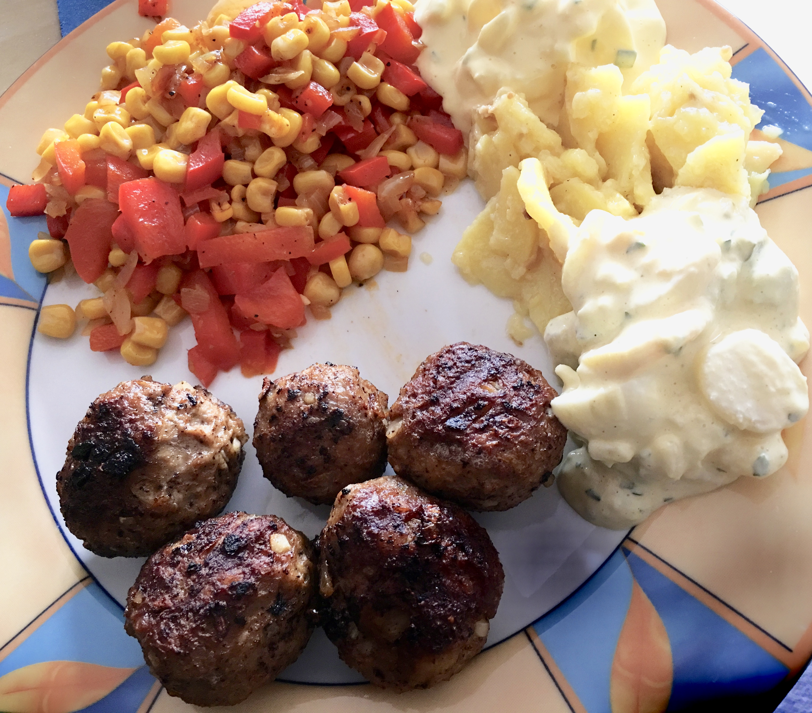

# German meat balls (aka Buletten)

## Buletten

Ingredients:

* 600g of ground beef/pork mix
* 2 eggs
* 1 to 2 german buns (kaiser-bröchten)
* enough Milk to wet the buns
* Salt, pepper and paprika to taste
* 1/2 bulb of garlic
* 1 large onion
* mustard

Preparation:

* chop onions and garlic (finer is better)
* cut buns in peaces, add milk and squish until buns are mushy
* add meat and eggs
* add mustard, salt, pepper, paprika
* squish the mixture

## Tomato sauce

* 3 cans of peeled tomatos
* 3/4 large onion
* 1/2 bulb of garlic
* salt/pepper/italian herb
* olive oil
* tomato paste (1/2 tube)
 

## Pics

