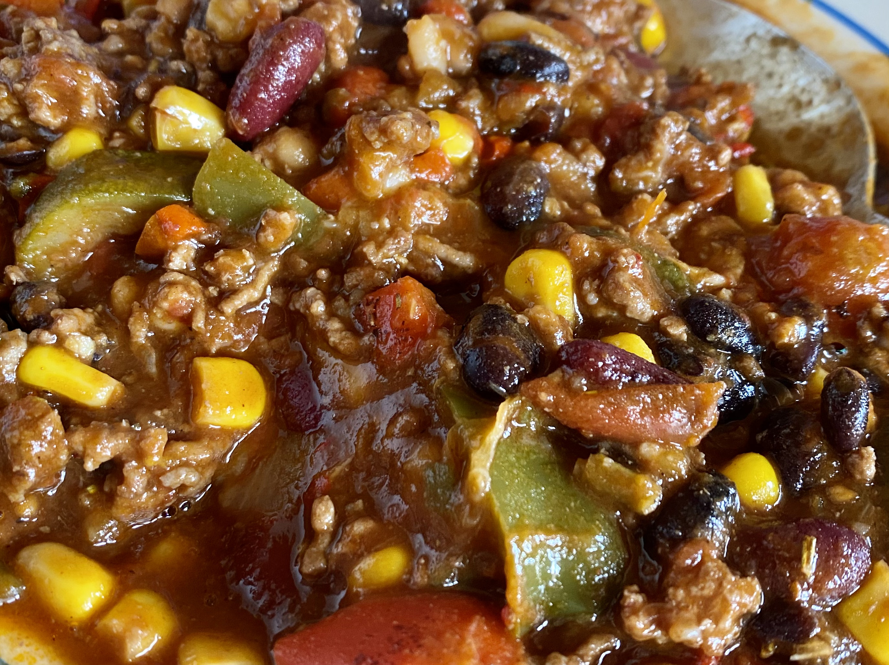
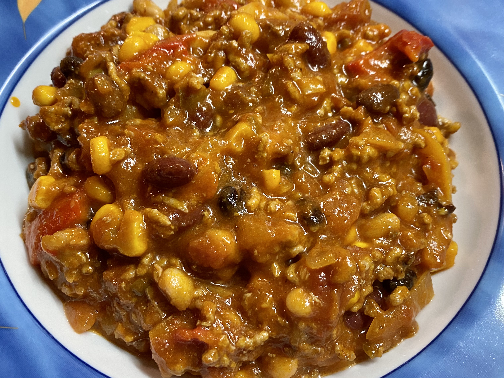

# Oli's Red Chili with Beans

This is not supposed to be a regular, well known Chili Con Carne. This is my own crazy version of whatever looks like a Chili Con Carne.

### Fry in pan

* 400g / 15oz of ground beef
* For germans: I usually use "beef/pork mix", just because I find it a bit juicier
* make sure the meat gets a good brown crust and not just turns grey. we want the Maillard reaction in action.
* probably you have to crank up the heat to max or fry in small portions
* at the end, reduce heat, add a table spoon of tomato concentrate to the pan, stir and let it cook for 2-3 minuntes

### Fry in pan

* 16 chili peppers, chopped
* buy whatever chilli peppers you can get, I usually get a variety of peppers
* you may want to remove the seeds to reduce the heat
* fry with a tea spoon of oil for 2-3 minutes

### Fry in pan

* one large onion, chopped
* some garlic cloves, chopped
* fry with a tea spoon of oil for 2-3 minutes

### Fry in pan

* 4 bell peppers, preferably a red, a green, a yellow and an orange one
* cut into 1 cm squares and fry
* fry with a tea spoon of oil for 6-8 minutes

### Add to a large pot

* everything from the frying actions
* 5 table spoons of olive oil (it's okay if that looks like a bit too much olive oil)
* 800g / 28oz of peeled tomatos in a can
* a bottle of sieved tomatoes (in Germany "Passierte Tomaten in der Glasflasche")
* 1 table spoons of honey
* a cup of Whiskey
* 2 table spoons of ground cumin
* 4 table spoons of sweet paprika powder
* 1 table spoons of smoked paprika powder
* a couple of dashes of tabasco

=> Cook on low-medium heat for 1h.

### Add

* small can of corn
* can of kidney beans
* can of pinto beans
* can of black beans
* can of white beans
* if the beans come in some sort of sauce, wash them under running water before adding to the pot
* if you want to use Pinto Beans in Germany, watch out for "Wachtelbohnen"

### To taste

* salt/ regular black pepper
* and finally simmer for another 20 minutes

### Serve

* I really enjoy this meal with Tortilla chips

## Pics

