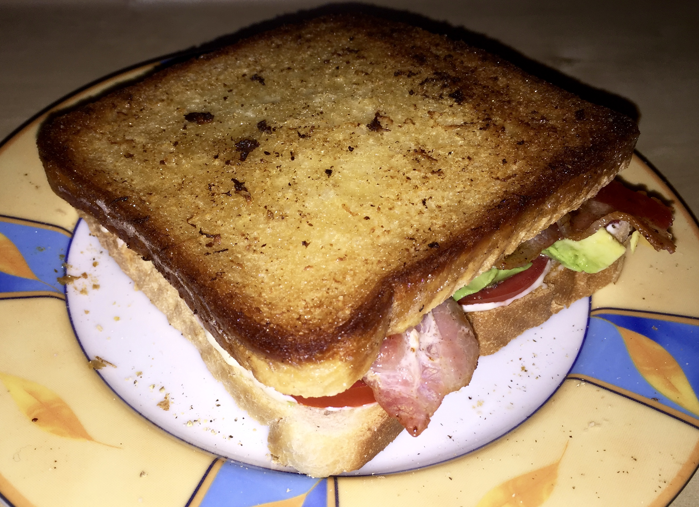

# Guacamole, Bacon, Grilled cheese sandwich

Serves 1 person

## Guacamole

- 1/2 Avocado, mashed
- 1/2 Onion, chopped
- 2 cloves of garlic, chopped
- 1/2 Tomato, chopped
- Handfull of Cilantro, chopped
- 1/2 Tea spoon of lime juice
- 1/2 chili pepper, chopped
- Salt and pepper to taste

## Bacon

Fry 6 slices of bacon and put aside

## The toast

- Butter toast. Put toast with buttered side down in a frying pad
- Add 1/2 cup of shredded cheese (like emmentaler) on top
- Add Guacamole on top
- Add bacon on top
- Button another toast and put butter side up on top

- Fry for 3-4 min until bottom toast is brown

- Turn over toast and fry for another 3-4 min

## Pics

