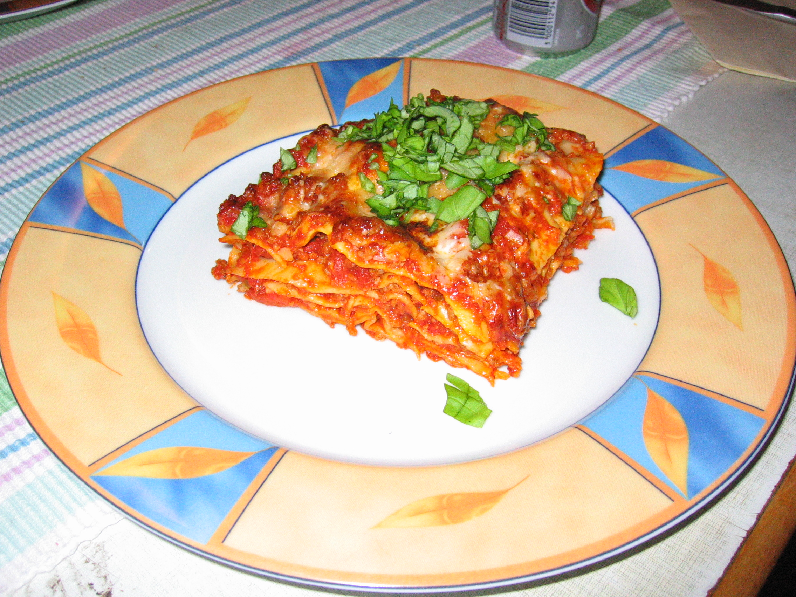

# Lasagne

* 500g of ground beef/pork mix
* 3 cans of peeled tomatos
* 50g Parmigiano-Reggiano
* 150g mozarella
* salt/pepper/italian herbs
* 100g tomatenmark 
* one large onion
* one garlic
* a little bit of cream
* 1 box of lasagna sheet

## German instructions

* hackfleisch in der pfanne anbraten (in kleinen portionen)
* zwiebeln in olivenöl glasig braten
* alles in einem topf geben, 5-8 knoblauchzehen dazugeben, tomaten aus dem blender dazugeben
* mit salz, pfeffer, kräutern abschmecken und kochen
* mit hackfleischsschicht anfangen. abwechselnd mit nudeln schichten. oben hackfleisch und kaese
* ganz wenig süße sahne oben drauf
* 160°C ca. 30 min. dann 190°C für 5.

## Thoughts

* don't use too much Parmigiano-Reggiano as it's very salty

## External links

* [chefkoch.de](http://www.chefkoch.de/rezepte/1375591242637628/Sizilianische-Maennerlasagne.html)
* [resepiz.com](https://resepiz.com/post/sicilian-mans-lasagna-10)

## Pics

