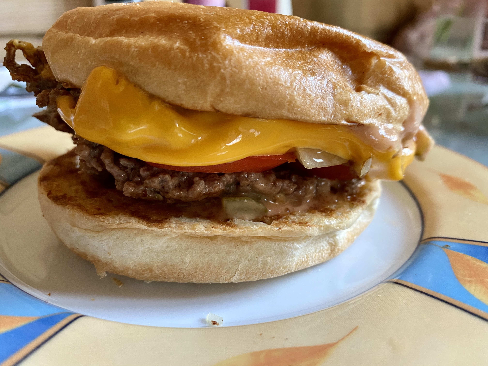
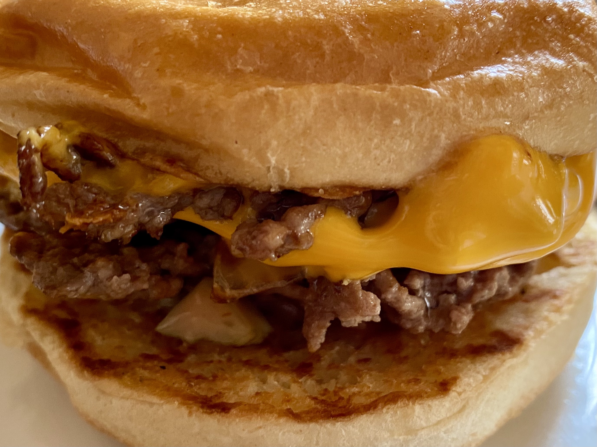

# Oli's US style smashed burger

This is a recipe how to do proper U.S. style smashed burger in Germany

## Tools needed 

These are absolutely necessary.

* unbeschichtet Edelstahlpfanne mit Deckel
* Patty Smasher: https://www.amazon.de/gp/product/B07TYPZDN6
* Grillspachtel: https://www.amazon.de/gp/product/B003AKCQXQ

## Ingredients

* Beef
  * use "halb und halb" (Beef & Pork mix)
  * do not fiddle with the meat, do not make balls, just "cut" the meat into chunks, each ~50g
* Buns
  * You need to buy those https://www.edeka.de/de/produkte/edeka-4-brioche-burger-buns-250g - DO NOT USE ANY OTHER
* Tomato, sliced
* Onions, sliced
* American Cheese: https://woerle.at/en/kaese/xxl-burger-slices/
* The spread
  *  3 parts Ketchup (regular Heinz)
  *  1 part Mustard (Löwensenf medium)
  *  1 part Mayonaise
  *  1 chopped pickled cucumber (https://www.kuehne.de/gurken/schlemmertoepfchen-feine-guerkchen-580ml)
  *  2 tea spoons of pickled cucumber water
* A tea spoon butter
* Salt & Pepper

## Variations

### Onions

You can either use raw onions or grilled onions. I prefer grilled onions. Just grill your onion slices before doing anything else.

### A hotter spread

You might add 2 slices of chopped Jalapenos (https://www.kuehne.de/antipasti/feurig-scharfe-jalapeno-370ml) to the spread to make it hotter. I like that.

### 1 or 2 meat patties

While I prefer 2 meat patties (with one cheese slice), there are other people preferring just 1 meat patty.

## Directions

### Step 1: toasting the buns

* Butter both buns with a tea spoon of butter
* Put the buns into a pan on low-medium heat

### Step 2: frying the meat

* Heat a second pan to medium-high heat, add a bit of oil
* Put 2x 50g of meat into the pan
* Press each meat chunk down with the "patty smasher". They should have a height of 3-4 mm
* Fry for ~2 min, there should be some crust on the bottom side
* Use the Grillspachtel to scratch the heat of the pan and turn it
* Salt and Pepper the meat
* Put one slice of cheese to one of the meat
* add a table spoon of water into the pan and put the lid on
* fry for ~2 min

### Step 3: assembling

* After the buns a toasted
* Add spread to both sides
* Add (grilled) onions
* Add 2-3 slices of tomatos
* Finally add fried meat

## Pics

