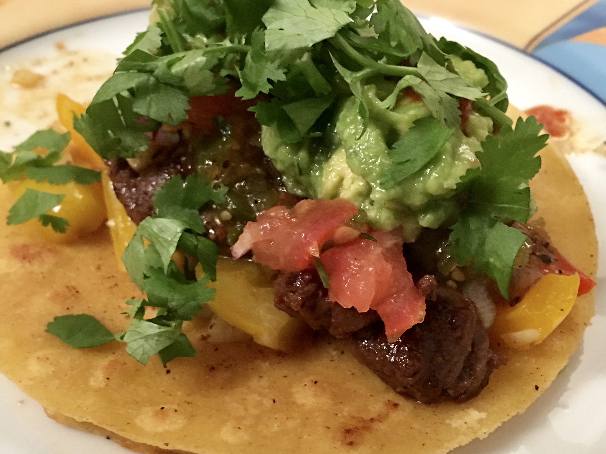

OLI'S GERMAN STREET TACOS

The MEAT

* 150g (Filet) steak per person 

Prepare a marinade. 
Stir:
* 1/2 cup of worcestershire sauce (ca. 120ml)
* juice of 1 Lime
* teaspoon paprika powder
* teaspoon Tabasco
* teaspoon ground cumin
* tablespoon oil (sunflower)
* Salt, Pepper to taste

Slice steak into thin strips and add marinade. Put into bag and fridge-it for 12h. Finally fry/grill it.

The VEGGIES

* Cut Bell pepper, Onions, Garlic, Chili's and steam it
* Salt, Pepper to taste

The TACO

* Fry 2 (Yellow) Corn Tortillas in a pan for 1-2 min each side
* Add veggies and meat
* Add Red & Green salsa, corn salsa, pico de gallo, Guac (Chipotle sells all of them separately)
* Add freshly chopped cilantro and a squeeze of lime

Enjoy ;)

## Pics

